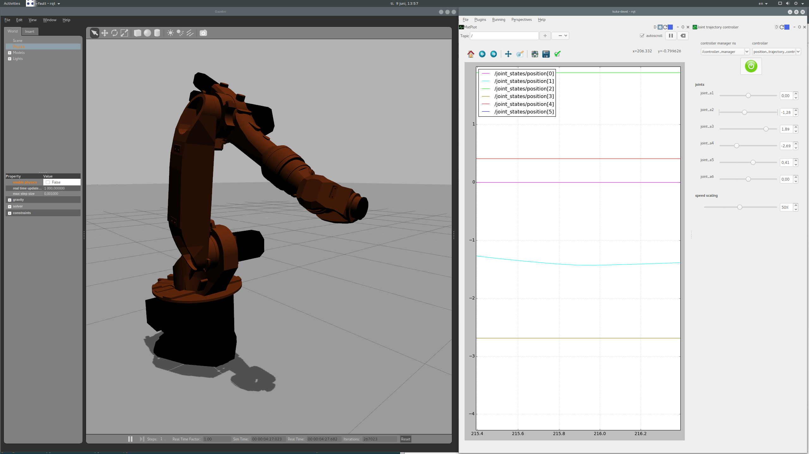

kuka_kr16_gazebo
================



## Usage
The simulation starts up paused by default. This enables us to turn off the physics engine, this is important to get the desired behaviour from the ros-control position controller.


To bring up the simulated robot in Gazebo, run:
```
roslaunch kuka_kr16_gazebo test_kr16_2_gazebo.launch
```
